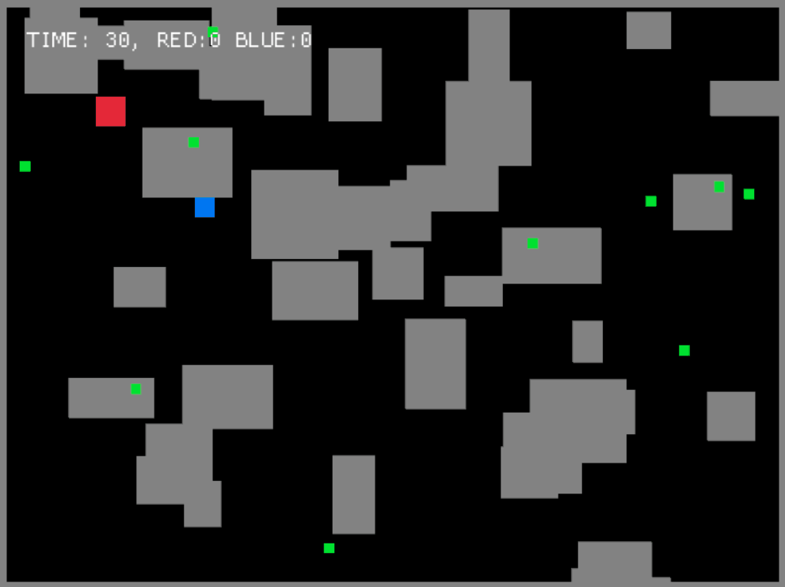

# Could Be Better (CBB) Game Engine

CBB Game Engine is a simple 2D meta-game engine based on [macroquad](https://github.com/not-fl3/macroquad). The quality could be better, but it works.

## Features

- Event system
- Input system
- Collision system
- On-Screen display (OSD)
- Gamepad support

## Demo

